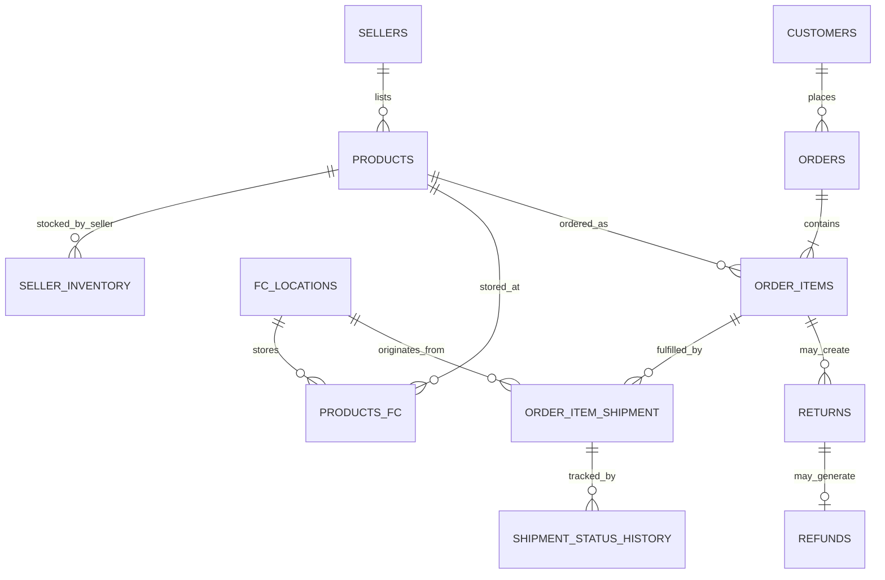

# E-commerce Fulfillment & Order Operations Database

**MySQL · Relational Database Design · Fulfillment Analytics · SQL Reporting · Query Optimization**

This is the portfolio version of my MSc Data Analytics relational-database assignment. The academic project modelled a broad e-commerce platform with 50+ tables across identity, customers/sellers, catalog, fulfillment centres, inventory, carts/wishlists, promotions, orders, billing, payments, shipments, returns, reviews and refunds.

For portfolio review, I narrowed that large academic schema to the operational path most relevant to analytics and fulfillment roles: **product/inventory → order item → fulfillment centre → shipment/status history → return → refund**.

## Business problem

An e-commerce operations team needs reliable relational data to answer questions such as:

- Which sellers and products generate the most revenue and order volume?
- What inventory is held for a product or fulfillment location?
- Which shipments are still open or have stopped progressing?
- How do order, return and refund volumes change over time?
- Which products have unusually high return rates?
- Can frequently used analytical queries be simplified and optimized?

## Portfolio architecture

## SQL included

- [`sql/01_fulfillment_schema.sql`](sql/01_fulfillment_schema.sql) — standalone MySQL 8 portfolio schema for the fulfillment/order slice.
- [`sql/02_reporting_views.sql`](sql/02_reporting_views.sql) — monthly seller performance and order/return/refund trend views adapted from the assignment.
- [`sql/03_operational_queries.sql`](sql/03_operational_queries.sql) — inventory, shipment, seller and returns reporting examples.
- [`sql/04_query_optimization.sql`](sql/04_query_optimization.sql) — CTE-based rewrite of a repeated nested aggregation used to identify above-average return-rate products.

## What the full academic project demonstrated

- Relational schema design with primary keys, foreign keys, checks and many-to-many junction tables.
- Normalization, including separating postal-code dependencies from addresses and removing a transitive order dependency from payments.
- Sample data ingestion.
- Analytical views for seller revenue/order/unit performance and monthly order/return/refund trends.
- Multi-table analytical SQL using joins, CTEs, `CASE`, `HAVING`, aggregate functions and date logic.
- Query optimization by calculating product return metrics once and reusing the result through CTEs.

## Relevance to warehouse / WMS analytics

This is **not production WMS experience** and I do not present it as such. It does, however, demonstrate hands-on work with several data concepts that appear in warehouse and fulfillment systems: inventory, fulfillment locations, item-level shipments, status history, returns/refunds, operational reporting and SQL troubleshooting.

That makes the project useful evidence for roles where SQL/reporting skills must be applied to warehouse or fulfillment workflows while learning the company-specific WMS application.

## Academic source

Original assignment: **Relational Database Design, Implementation, and Analytics**, MSc Data Analytics, 2026.
