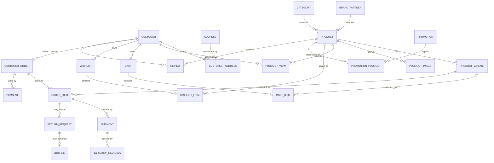

# Zalando Marketplace — Relational Schema & Analytics

**PostgreSQL · E-commerce Data Architecture · ER Modelling · SQL Analytics · Data Quality**

This project turns a product-dissection assignment into a complete portfolio database implementation for a Zalando-style fashion marketplace. The original coursework identified the customer journey and proposed entities for products, size/color variants, carts, wishlists, orders, payments, delivery, returns, refunds, reviews and promotions. The portfolio version completes the missing technical implementation with a runnable PostgreSQL schema, sample data and business queries.

> This is an educational data model inspired by public Zalando shopping features. It is not Zalando's internal production schema.

## Business journey modelled

A customer can discover a fashion product, select a size/color SKU, save it to a cart or wishlist, place an order, pay, receive item-level delivery tracking, request a return, receive a refund and leave a review. Brands/retail partners, promotions and product-view events are also represented so the database supports both operations and analytics.

## Core model

## Files

- [`sql/01_schema.sql`](sql/01_schema.sql) — complete PostgreSQL relational schema.
- [`sql/02_sample_data.sql`](sql/02_sample_data.sql) — small synthetic dataset for running the queries locally.
- [`sql/03_business_queries.sql`](sql/03_business_queries.sql) — product, sales, returns, inventory, promotions and delivery analytics.

## Analytical questions

The project supports questions such as:

- Which brands generate the most revenue?
- Which product variants are running low on stock?
- Which categories have the highest return rate?
- Which products receive the most views but weak conversion?
- What is average order value over time?
- Which promotions are associated with the strongest product sales?
- Which shipments have not progressed recently?
- Which brands have the strongest customer ratings?

## Why the schema is structured this way

Product and variant are separate because fashion products can have many size/color combinations and stock must be maintained at SKU level. Orders are separated from order items because a checkout can contain multiple variants. Returns are attached to order items because customers often return only part of an order. Promotions use a junction table because a promotion can cover many products and the same product can participate in multiple campaigns over time.

## Completion status

The academic draft was conceptually strong but not portfolio-complete: one document still contained parts of the Instagram example, and the improved Zalando report ended its SQL appendix mid-script and did not include a final ER diagram or executable analytics. This GitHub version closes those gaps with a coherent implementation that can be reviewed independently of the report.

## Skills demonstrated

**PostgreSQL · Schema Design · Primary/Foreign Keys · Constraints · Hierarchical Categories · SKU Modelling · Transaction Data · Returns/Refunds · SQL Joins · CTEs · Window Functions · Aggregations · Business Analytics**
